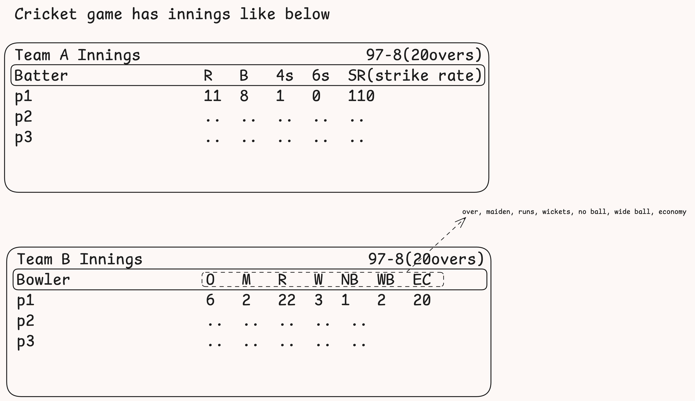

# Low Level design of CrickBuzz

## Requirement gathering
Score card gets updated ball by ball(as an when the new delivery is made
the score card is updated)

## Objects
Match: has Inning
Team: has Player
Player
Inning: has Over
Over:has Ball
Ball
ScoreCard: has all of the details of various objects

