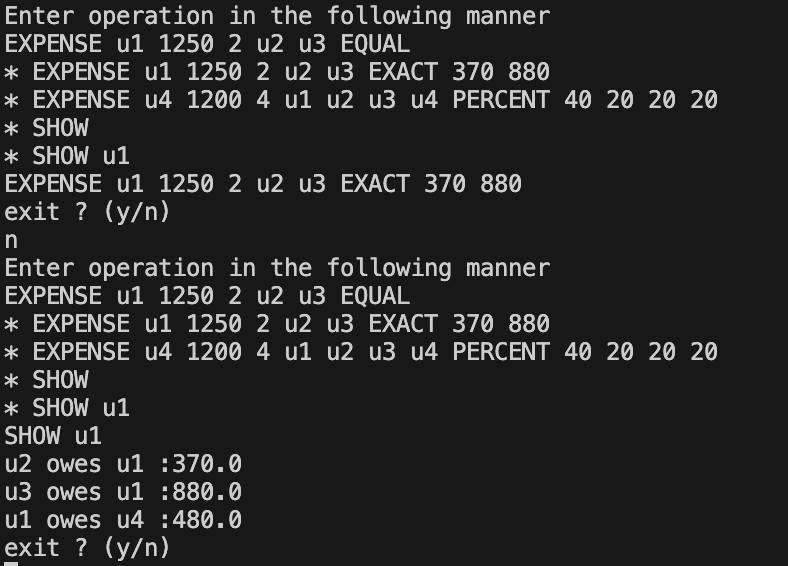
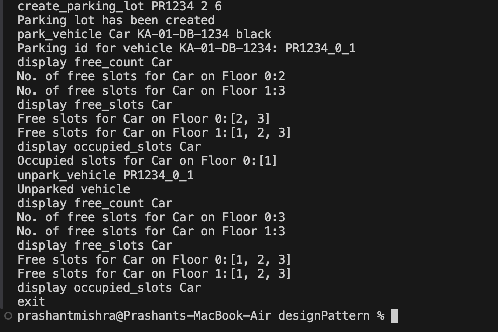

# [Machine coding](https://workat.tech/machine-coding/article/how-to-practice-for-machine-coding-kp0oj3sw2jca)

## Splitwise

This is terminal/command line based application in java, this allows you/team of people to manage their expenses and split the spent amount bewteen people involved in the expense.
Demo of the output of the application is show below.

---

## [Parking Lot](machinecodingexamples/parkinglot/ReadMe.md)
This is a terminal/command line based java application that implements **Parking Lot System**

**Purpose**
The purpose of this app is to help in parking of 3 different types of vehicle 
- Car
- Bike
- Truck
Note: *later more vehicles can be accommodated by expanding the scope of the application*

