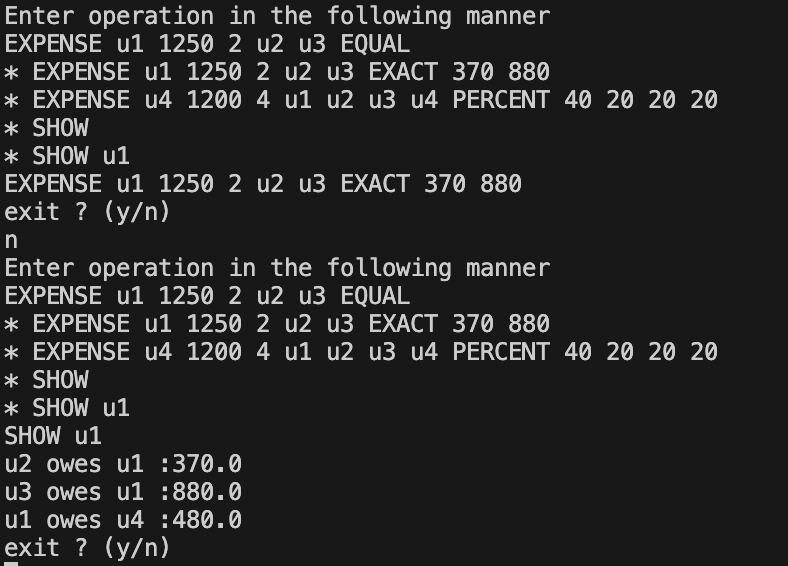

# [Splitwise](https://workat.tech/machine-coding/practice/splitwise-problem-0kp2yneec2q2)

---

**This is a simple terminal/command-line based java application, that simulated the spliwise application.**

--- 

Features
-
- We can split expense between the involved people 
- We can split the expense `EQUAL`, `EXACT`, and/or `PERCENTAGE` wise between the involved users
- We can view the expense history of a user or all the users, this gives us information about who owes how much amount to which user.
  
---

Sample output of application
-

