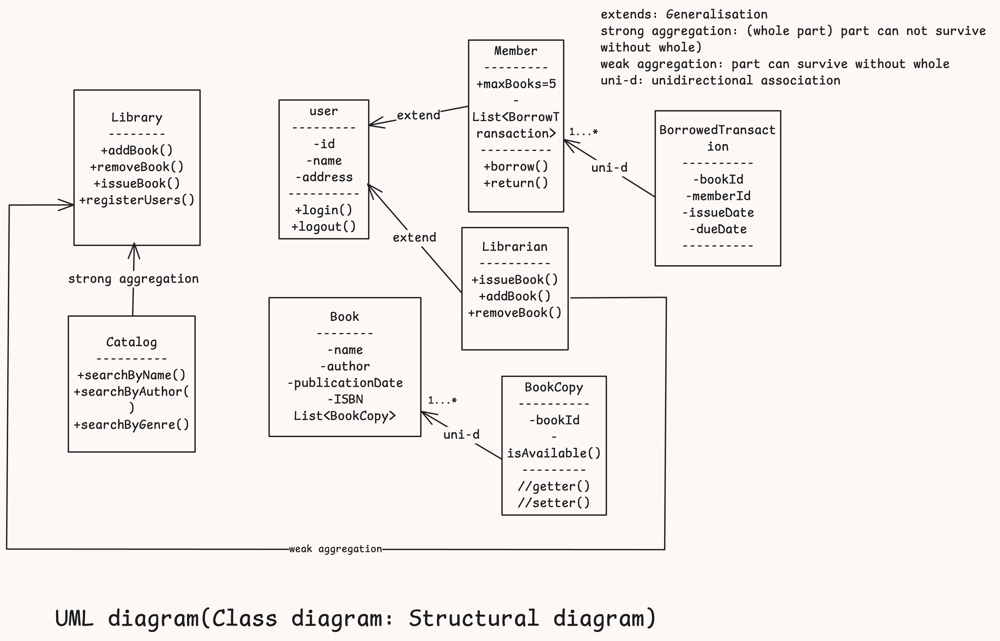

# Library Management System


## Requirements

### User Management

Users(Member/librarians) should be able to register, login, logout.
### Book Management

Books can be added/updated/removed/tracked/ and searched by title, author, genre
### Book borrowing and returning

Member can borrow and return books
Librarian can issue book
### Search catalog

Users should be able to search books based on title, author, genre, etc
### Notification

Librarian can send notification to member for delayed return of the book

--------------Assumptions--------------------

Member can only borrow some x no. of books

There is a due date of say 10 days for each book borrowed by member

Each book has multiple copies and can be identified by uniqueId

Notification is out of scope
    

## UML Diagram: Class Diagram

## Code Snippets



```java
//User: Member, Librarian
abstract class User{
    private String userId;
    private String name;
    private String address;
    public abstract void login();
    public abstract void logout();
}

class Member extends User{
    public static final MAX_BOOK = 5;
    public List<BorrowTransaction> borrowedBooks;

    public boolean borrowBook(BookCopy book){
        if(book.isAvailable() && borrowedBooks.size()<MAX_BOOK){
            borrowedBooks.add(new BorrowTransaction(this,book));
            book.setAvailable();
            return true;
        }
        return false;
    }
    public void returnBook(BookCopy book){
        book.markAvailable();
        borrowedBooks.removeIf(transaction-> transaction.getBookId().equals(book.getBookId()));
        return true;
    }

}

class Librarian{
   public void addBook(Book book, Library library){
    library.addBook(book);
   }
   public void issueBook(Member member, BookCopy book){
    member.borrowBook(book);
   }
   public void returnBook(Member member,BookCopy book){
    member.returnBook(book);
   }
}

///Book and BookCopy
class Book{
    private String title;
    private String author;
    private String ISBN;
    private List<BookCopy> copies// no. of copies of the book available in the library

    //getter
    //setter
    public void addCopy(BookCopy copy){
        this.copies.add(copy);
    }
    public void removeCopy(BookCopy copy){
        this.copies.remove(copy);
    }
}

class BookCopy{
    private String bookCopyId;
    private boolean isAvailable;

    public boolean isAvailable() {return this.isAvailable;}
    public boolean setAvailable(){isAvailable  = true;}
}


//Borrow Transaction

class BorrowTransaction{
    private String memberId;
    private String bookCopyId;
    private Date borrowDate;
    private Date dueDate;
    public BorrowTransaction(Member member,BookCopy copy){
        memberId = member.getMemberId();
        bookCopyId = copy.getBookCopyId();
        borrowDate = new Date();//current date will be the date of borrow
        dueDate = calculateDueDate();
    }
    public Date calculateDueDate(){
        Calendar c = Calendar.getInstance();
        c.add(Calendar.DATE,14);//two weeks borrowing period
        return c.getTime();
    }
}


//catalog

class Catalog{
    private Map<String,List<Book>> titleMap;
    private Map<String,List<Book>> authorMap;

    public List<Book> searchByTitle(String term){
        return titleMap.getOrDefault(term, new ArrayList<>());
    }
    public List<Book> searchByAuthor(String term){
        return authorSearch.getOrDefault(term, new ArrayList<>());
    }
}

//library

class Library{
    private Map<String, List<User>> users;
    private Catalog catalog;
    private Librarian librarian;

    //initialize via constructor dependency injection

    public void addBook(Book book){
        //implementation
    }
    public registerUser(User u){
        users.put(user.getUserId(),user);
    }
    public void issueBook(Member member,BookCopy book){
        librarian.issueBook(member,book);
    }
    public void returnBook(Member member,BookCoy book){
        librarian.returnBook(member,book);
    }

}

```
## Key takeaways
Proper separation of concern 
Proper capture of Entities andd their relationship
Scalability in terms of adding more books and having searched through the list of available books via catalog


