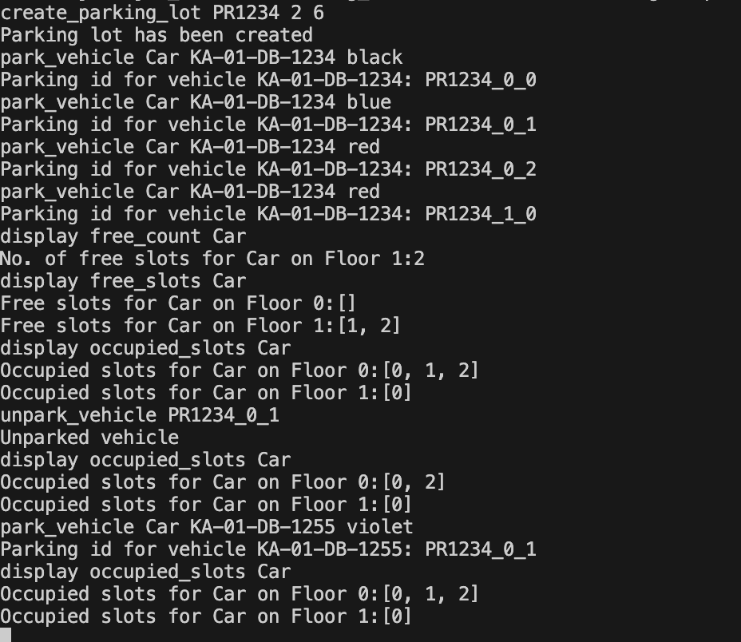

# [Design Parking Lot](https://workat.tech/machine-coding/practice/design-parking-lot-qm6hwq4wkhp8)

This is a terminal/command line based java application that implements **Parking Lot System**

## Purpose
The purpose of this app is to help in parking of 3 different types of vehicle 
- Car
- Bike
- Truck
Note: *later more vehicles can be accommodated by expanding the scope of the application*

## Feature

- **Create parking lot**: This helps in creating the parking lot building like : numbers of floors, number of slots that we need to create to accommodate vehicles etc
- **Park Vehicle**: We can park 3 different type of vehicle as of now ( Car, Bike, and Truck)
- **Unpark Vehicle**: This helps in unparking the vehicle given the parking ticket of the vehicle and it will free the slot that was occupied by earlier parked vehilce
- **Get Free Slots Count**: This helps in knowing how many slots of given vehicle type is available in the parking lot building
- **Get Free Slots Numbers**: This helps in knowing the slots numbers that are free of the given vehicle type
- **Get Occupied Slots**: This helps in knowing the slots that are occupied by the given vehicle type
  
The code in branch `feature/modularizeCode` is more modularize, a lot of unused mothods have been removed.

This application follows java principles like `inheritance` ( for more details refer the `slot`, `vehicle` packages), `Encapsulation` refer the `Floor.java` that has most important `variables`, `methods` which are crucial to the app.

The `Main.java` takes all the input from the user and calls methods like `parkVehicle()`, `unparkVehicle()`, `display()` which are defined in the `ParkingLotUtility.java` which acts as a orchestrator between` Main.java` and other classes in the application related to `Floor`, `Slot`, `Vehicle`.


  
## Advantage 
- This application automates the process of vehicle parking.
- We get to know details of free, occupied slots and details of those slots like which floor the slot is available in, for the given vehicle type.


## Demo
<a href=""></a>

Note: *Input format* 

```java
//It is assumed that the in each floor of the building 1 slot is for Bike 2 slot is for Truck and rest of the slots are for the Car.
 /*
         * create_parking_lot PR1234 2 6 //2 is number of floors in the parkinglot building and 6 is no of slots per floor
         * park_vehicle Car KA-01-DB-1234 black
         * display free_count Car
         * display free_slots Car
         * display occupied_slots Car
         * unpark_vehicle PR1234_0_1
         * exit
         */
```