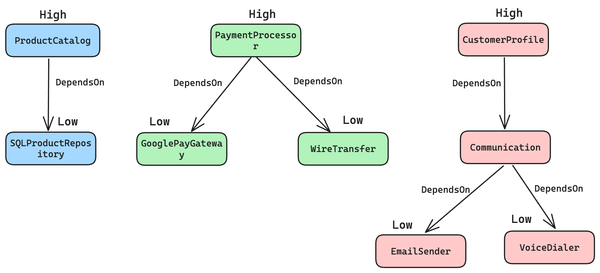
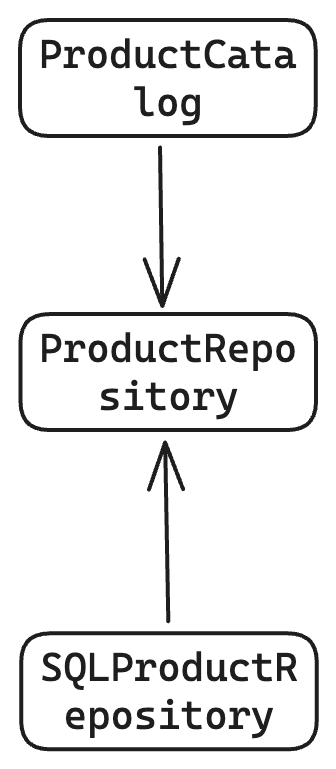
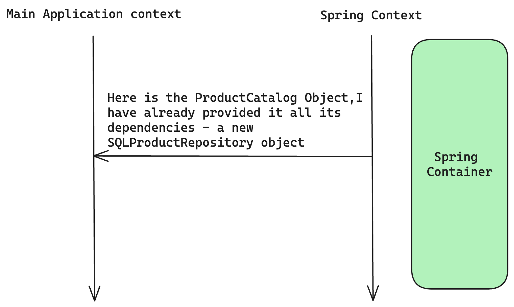

# Dependency Inversion Principle (DIP)

> High-level modules should not depend on low-level modules. Both should depend on abstractions.

> Abstractions should not depend on details, details should depend on abstractions.


Let's understand the **High-level modules** and **Low-level modules** through an example:



In an e-commerce app like flipkart on high level it can be categorized as `ProductCatalog`, `PaymentProcessor`, and `CustomerProfile` (these are some of the main business functions)
These business function inter depend on other modules show in the above image.

Note: the modules on top are closer to business function called **High** level modules.
The modules at the bottom are close to the implementation details called **Low** level modules.

Low level modules are `SQLProductRepository`, `GooglePayService`, `WireTransfer`, `EmailSender` and `VoiceDialer`.

If we consider `CustomerProfile` (High Level module) and `Communication` module alone then, `Communication` is Low level module but if we consider `Communication`, `EmailSender` and `VoiceDialer` alone then,`Communication` becomes High Level module, and `EmailSender` and `VoiceDialer` are Low level modules.

The point here the concept of **High and Low level module** is not absolute but **relative**.

According to image above `ProductCatalog` depends on `SQLProductRepository` i.e a high level module depends on a low level module, but this directly **conflicts with the DIP's 1st definition**.

---

Lets take `ProductCatalog` &rarr; `SQLProductRepository` relationship and analyze further.

```java
import java.util.List;
/*
 * High Level module
*/
public class ProductCatalog {
    public void listAllProducts(){
        SQLProductRepository sqlProductRepository = new SQLProductRepository();
        List<String> allProductsNames = sqlProductRepository.getAllProductNames();
        //Display all products names
    }
}
```

```java
/*
 * Low level module 
*/
import java.util.Arrays;
import java.util.List;
public class SQLProductRepository {
    public List<String> getAllProductNames(){
        return Arrays.asList("soap","toothpaste");
    }
}
```
As `ProductCatalog` directly depends on `SQLProductRepository` this is clearly violation of DIP definition 1 (as per the definition **both High and Low level modules should depend on abstraction**)

Let's fix this as per definition 1:

creating interface `ProductRepository`

```java

import java.util.List;

public interface ProductRepository {
    public List<String> getAllProductNames();
}
```
Implementing this interface in `SQLProductRepository` 

```java
/*
 * Low level module 
*/
import java.util.Arrays;
import java.util.List;
public class SQLProductRepository  implements ProductRepository{
    @Override
    public List<String> getAllProductNames(){
        return Arrays.asList("soap","toothpaste");
    }
}
```
Finally for High level module `ProductCatalog` we **should not** directly instantiate `SQLProductRepository` in it. We will use a `ProductFactory` class for the same

```java
public class ProductFactory {
    public static ProductRepository create(){
        return new SQLProductRepository();
    }
}
```
We will use `ProductFactory` to instantiate the `SQLProductRepository`
```java
/*
 * High Level module
*/
import java.util.List;

public class ProductCatalog {
    public void listAllProducts(){
        ProductRepository productRepository = ProductFactory.create();
        List<String> allProductsNames = productRepository.getAllProductNames();
        //Display all products names
    }
}
```
Note our reference object is `ProductRepository` So, we don't have any tight coupling with `SQLProductRepository`

*After the modification the new dependency will look something like this*



The above changes are as per the DIP definition 1.
The above code change also follow the 2nd definition of DIP as well i.e Abstraction should not depend on the details, details should depend on the abstraction.
As we can see the image above `SQLProductRepository` depends on the `ProductRepository` not the other way around. **This is the reason why this principle is called Dependency Inversion Principle**

---

## Dependency Injection VS Dependency Inversion

    Even though they are related but they are not the same and can not be used interchangeably 

Understanding Dependency Injection:

In `ProductCatalog` we make use of Factory method `ProductFactory.create()` to get instance of `SQLProductRepository` object.
Though it delegates the instance creation process to factory class `ProductFactory` but the initialization process is still with the `ProductCatalog` class.
Ideally we don't want `ProductCatelog` class to worry about how and when to trigger the instantiation.
What if we provide the instantiated `ProductRepository` class to `ProductCatalog` even without it asking.

So, Main class `ECommerceMainApplication` makes use of the factory method `ProductFactory.create()` to create the instance of `ProductRepository` and this instance is passed as an argument in the constructor of `ProductRepositroy` class.

```java
public class ECommerceMainApplication {
    public static void main(String agrs[]) {
        ProductRepository productRepository = ProductFactory.create();
        ProductCatalog productCatalog = new ProductCatalog(productRepository);
        productCatalog.listAllProducts();
    }
}
```
After updating the `ProductCatalog` class accordingly

```java
import java.util.List;

public class ProductCatalog {

    private ProductRepository productRepository;

    public ProductCatalog(ProductRepository productRepository) {
        this.productRepository = productRepository;
    }

    public void listAllProducts(){
        List<String> allProductsNames = productRepository.getAllProductNames();
        //Display all products names
        allProductsNames.forEach(product-> System.out.println(product));
    }
}
```
Now the `ProductCatalog` is free to use the `SQLProductRepository` object when ever and where ever it wants. It no longer has not worry about  creating the `SQLProductRepository` object on its own.
In other words **we are injecting the dependency** into the `ProductCatalog` instead of `ProductCatalog` worrying about instantiating the dependency.
This is the concept of **dependency injection**

---

## Inversion of control - IOC

Even though it is not part if DIP(Dependency Inversion Principle), it is closely related

*Lets us understand this with the same above code*

The class `ProductCatalog` had a constructor that took in `ProductRepository` object.

The class that calls the `ProductCatalog` will provide or inject the object of `ProductRepository` in this case it is `ECommerceMainApplication`.
Note, even though the injection happens outside of the `ProductCatalog` class, the **injection still happens during the main flow of the program**. i.e the injection is happening in the main thread of the program execution.

*What if we want all the injections to happen in a separate thread or s separate context all together, So that main control flow is completely isolated from injection?*

This can be achieved using frameworks like **Spring**(in java).



**Spring will run its own context different** from the mail flow of the program
Spring will take care of injecting required dependencies of a class. So if you want to instantiate the object of a class, instead of doing it yourself directly in the code, you ask spring to give you the object of the class.
The Spring framework looks at all the dependencies required for the instantiation of the object, then goes ahead and injects all the dependencies and instantiate the object and gives it back to the main control flow.
Thus the control over dependency injection is completely delegated to Spring framework and does not happen in the mail control flow.
**This concept is called Inversion of Control (IOC)** and the Spring is called Inversion of Control Container or simply an **IOC Container**


