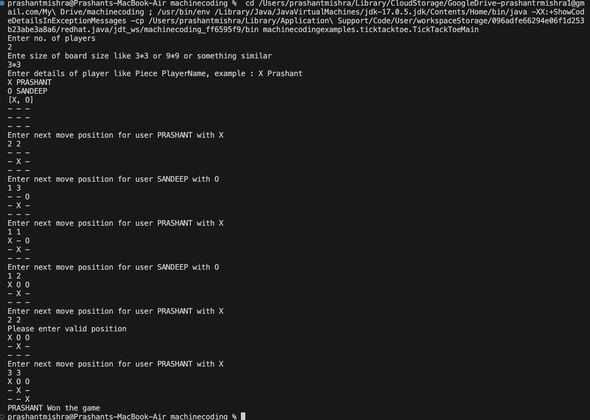

## [Tick Tack Toe](https://workat.tech/machine-coding/practice/design-tic-tac-toe-smyfi9x064ry)

**This is a simple terminal/command-line based java application for the game Tick Tack Toe**

Rules of the game
-

- The game is played between two players. One player owns the X pieces and can put it on  any of the empty cells in the grid. The other player owns the O pieces and can in any of the empty cells.
- The player with X makes the first turn. Each player plays alternately after that.
- The first player to form a horizontal/vertical/diagonal sequence wins.

--- 

Features
-
- Code is extensible to change the size of the grid
- Code is extensible to allow different types of pieces
- Code is extensible to allow more than 2 players/piece type
  
---

Sample output of application
-

