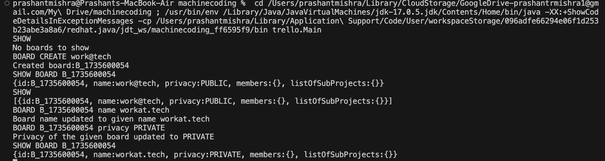

## [Trello App](https://workat.tech/machine-coding/practice/trello-problem-t0nwwqt61buz)

**This is a simple terminal/command-line based java application, that simulates the  trello like feature**

_Note: Trello is project management cum project tracking application similar to Jira application of Attlasian_

--- 

Features
-
- We can create as many` Board(s)` as we like, where a Board is nothing but a independent projct in the organization. 
- We can have many `Sub-Project(s)` within a boad like quater wise tasks that needs to be done
- We can have many `Sub-Task(s)` or Cards within a `Sub-Project`, this `Card` can be assigned to any `User` who is also part or the `Board` or Member of the `Board`
- We can udpate `names` of `Board`/`Sub-Project`/`Card`
- We can update `description` of the `Card`
- We can move `Card` between one `Sub-Project` to other `Sub-Project` within the same `Board`
- We can see details of `Board`their `Sub-Project(s)` and `Card(s)` present in those `Sub-Project(s)` and `User(s)` assigned to those `Card(s)`

---

Advantage:
-

- This application make use of `HashMap` for faster `retrival` of details of Card, SubProject, and Board, this makes searching time faster for all the data
- Code is modularized and easy to go through and understand
  
---

Sample output of application
-

Note : For input formats refer the `inputoutput.txt` and `inputoutput2.txt` file in `resources` folder